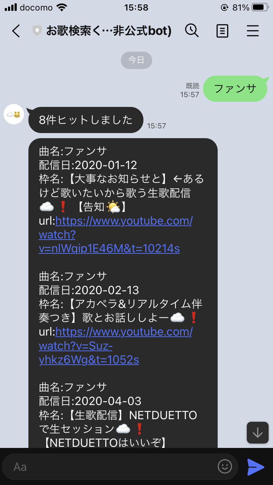

# 2回目更新

2回目の更新。
日でいうと作業開始から4日。
大枠が完成したのでgitにあげた。

## したこと
- ローカルでPostgreSQLを用いたDB作成
    - pythonから操作できることも確認
- HerokuのアドオンであるHerokuPostgresを有効化
    - テーブルの作成、動作確認完了
- Herokuサーバに移植
    - 動作確認完了
- 作成するbotの大枠が完成した

## 気付き
- 作業前に実現可能性の調査は必要
    - lineのmessaging APIの仕様としてreply_messageから返信可能なメッセージは5件が上限であることを開発中に知った。
    - 検索するお歌によっては、5件を超えるものがあるためこれの対応に急にしなければいけなくなった。
    - 前もって確認するべき。

## 次すること、したいこと
- 現在、曲名からしか検索できないので配信日や原曲の作曲者などからも検索可能にしたい
- lineの画面が公式lineアカウントに比べて味気ないので、リッチテキストというものを試してみる
- せっかく作ったので認証済みアカウントにして公開してみる。審査のようなものを受けるらしい
