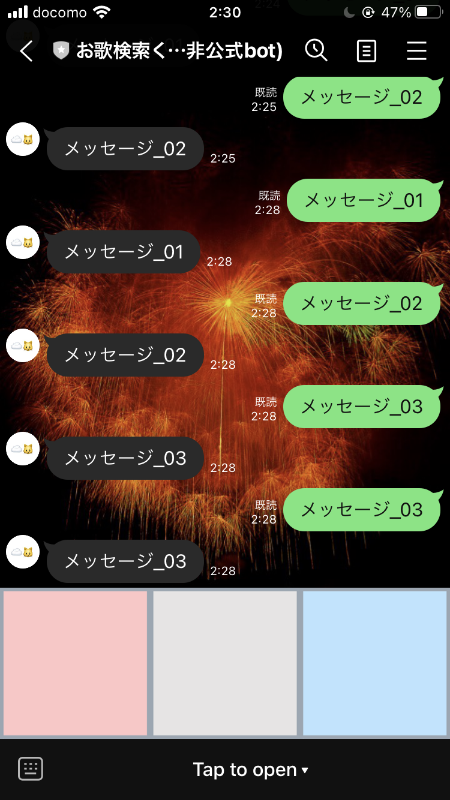

# 3回目更新

もう3回目の更新 
今のところ手記の更新は継続している 
アウトプットがあって、進捗があるのはいいことなので自分を褒めたい。よしよし 
ちょっと沼にハマりかけたが脱したので更新 

## したこと
1. リッチメニューとやらの調査
2. ローカルでリッチメニューのサンプルを動かした
    - 左の枠から順に、タップすると"メッセージ_n"という文言を送ることができるだけ
    - 動作確認完了 

## 気付き
- qiitaもいいけどドキュメント読みな
- line程のjapn_big_companyなら日本語版あるしそっち見た方が早い
- qiita漁りすぎて沼にハマりかけた

## 次すること、したいこと
1. リッチメニューを試すところまでできたので、ちゃんとした機能を実装したい
2. 配信タイトル、配信日、原曲のアーティスト名から絞りこめるようにしたい
    - リッチメニュー3枠で考えているため
    - メニュー押下時にselect文の分岐を行えばいいのよね？
3. メニューのボタンをもう少しこったものにしたい〜〜〜〜〜〜〜〜〜〜
    - 推しのカラーリングを意識しているけど〜〜〜〜〜〜〜〜〜〜〜〜〜
    - さすがにショボイしかっこわるい〜〜〜〜〜〜〜〜〜〜〜〜〜〜〜
    - デザインとかできる人来てほしぃ〜〜〜〜〜〜〜〜〜〜〜〜〜〜〜
    - いい感じのをつくって〜〜〜〜〜〜〜〜〜〜〜〜〜〜〜〜〜〜〜〜

### ひとこと
- lineからリンクを踏んだ際、(iOSでは)デフォルトだとline内でブラウザが開くようになっているが、 
    safariで開くことができるようになる設定を知った
    - lineからyoutubeアプリを開けるようになった！！
    - 結果、幸せになった(*´꒳`*)

- わすれないように記録を....〆(･ω･。) ﾒﾓﾒﾓ
    1. lineの設定から "LINE labs" を開く
    2. "リンクをデフォルトのブラウザで開く" にチェックを入れる!!だけ！！
    3. このbotを使うiosユーザはみんなした方がいい。幸せになれる 

