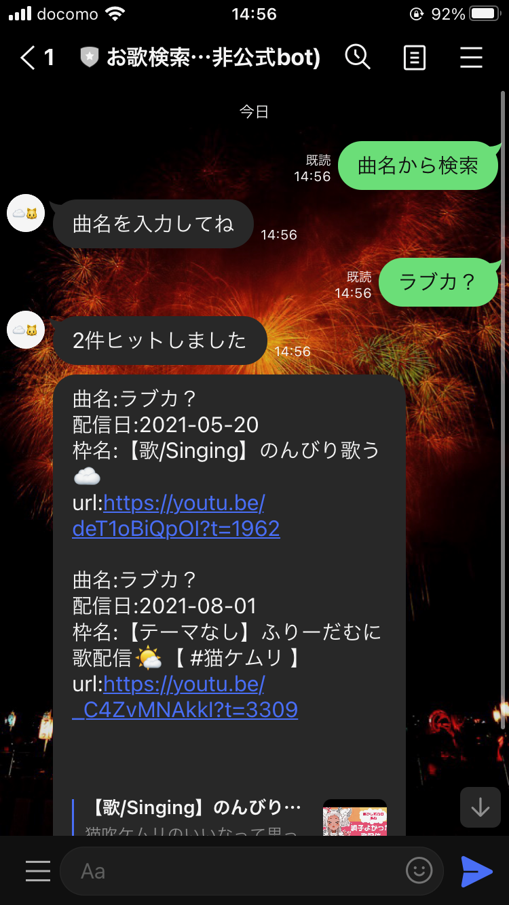
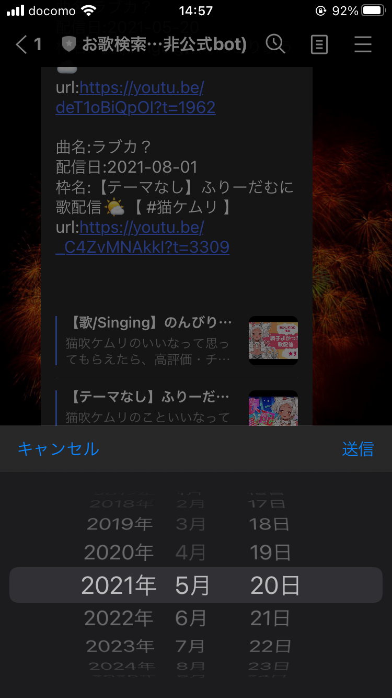
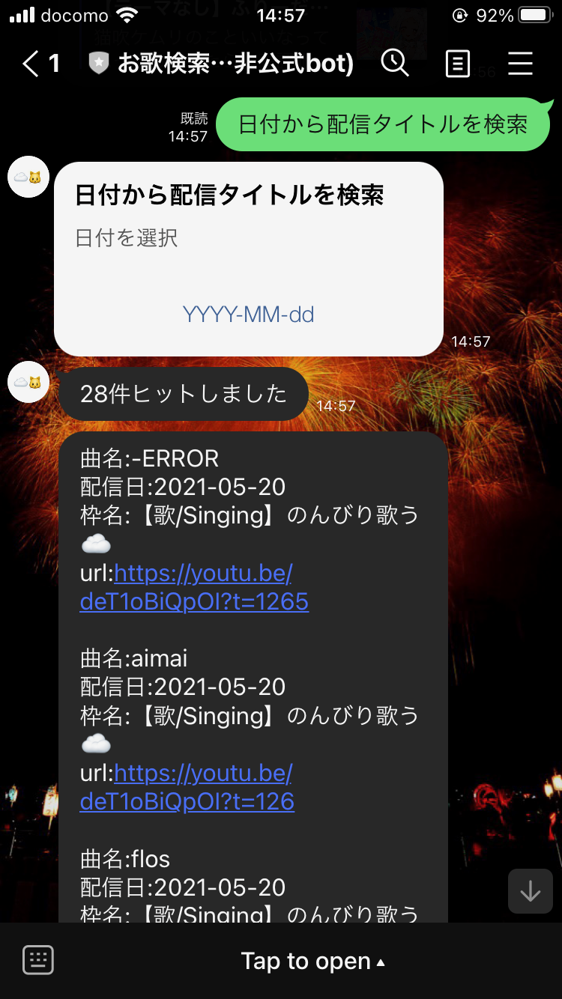
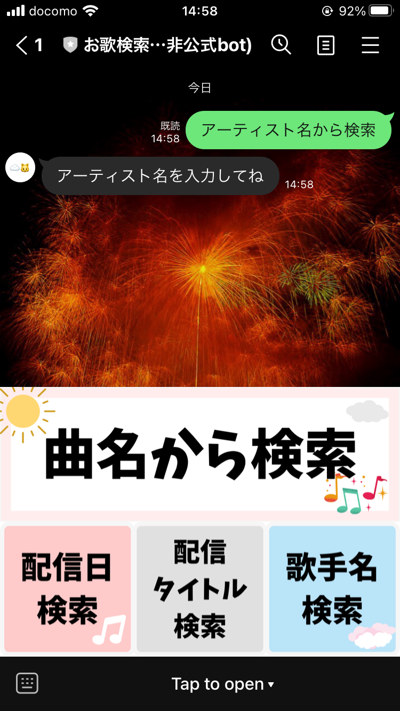
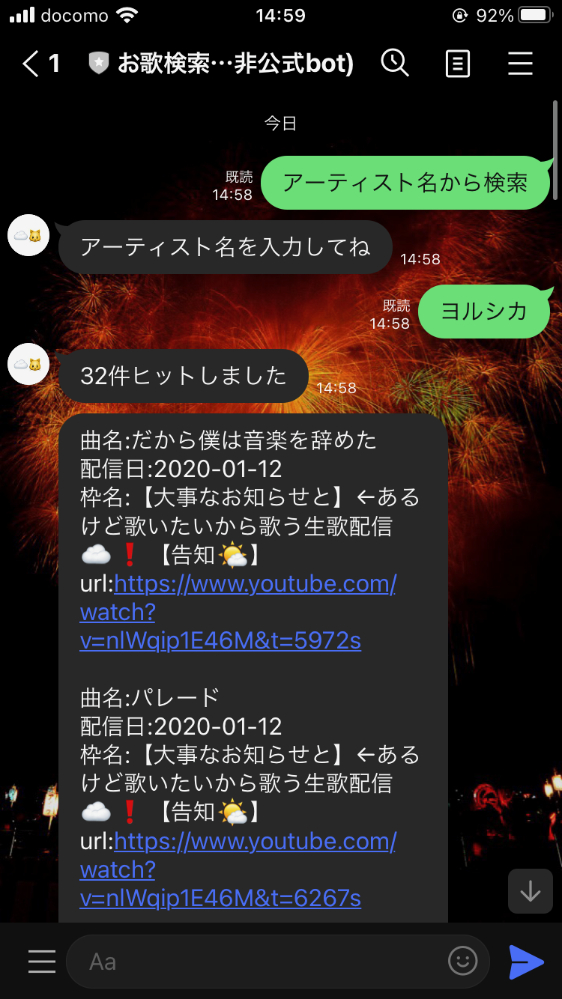
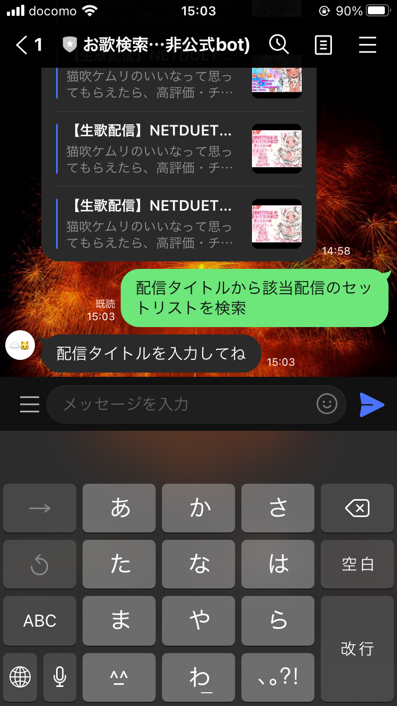
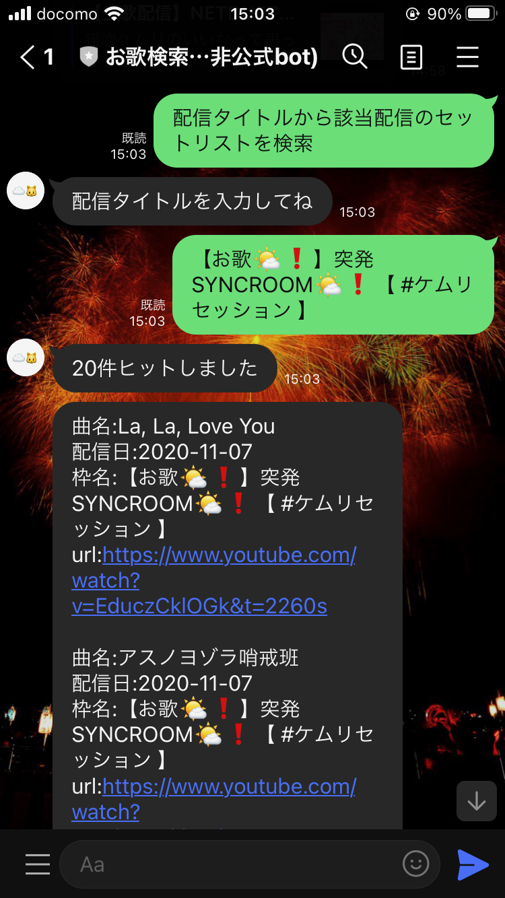

# 4回目更新

4回目の更新 
Ver1.0が完成したので更新 

## したこと
1. リッチメニュー押下でsql文の生成フラグ立て
    - botとの対話に2ターン必要なので、会話ステータスを保存する必要があった
    - ステータスを保存するテーブルを用意
    - ユーザIDとステータスを保存、必要な時に呼び出す

2. 本番環境にリリース
    - 動作確認完了

## 気付き
- 日付検索とタイトル検索って一緒なんじゃないか?
    - どっちで検索しても結果は一緒

- タイトル検索は完全一致のみ採用しているので使いづらい
    - lineを使用してる人は大概デバイスはスマホなのでタップで使いやすい方を使うはず
    - (そもそも自分で使ってて、めんどくさいなと思っている)
    - PCからタイトル検索する分には使える

- ~~アーティスト検索から"初音ミク"や"鏡音"を検索するとエラーが起こる~~
    - 検索結果が多すぎるせいか？
    - NGワードに設定してエラーを防止

    - どの検索で入力しても禁止ワードになっていた
        - 曲から検索ではokに修正する

## 次すること、したいこと
1. タイトル検索の廃止を検討
    - 代わりの検索条件を検討
    - タイトル検索をドラムロールから検索できるようにしたらかっこよくないか？

2. ひらがなとカタカナ、全角半角の区別をしないsqlを導入したい
    - カタカナを用いる曲やアーティストが多いので、検索ワードがひらがなでもヒットするようにする
    - 自作関数を作成する必要があるらしい

### ひとこと
- とりあえず完成したので概ね満足
- まだ公開してないので、公開までトライ&エラー、スクラップ&ビルドを継続
