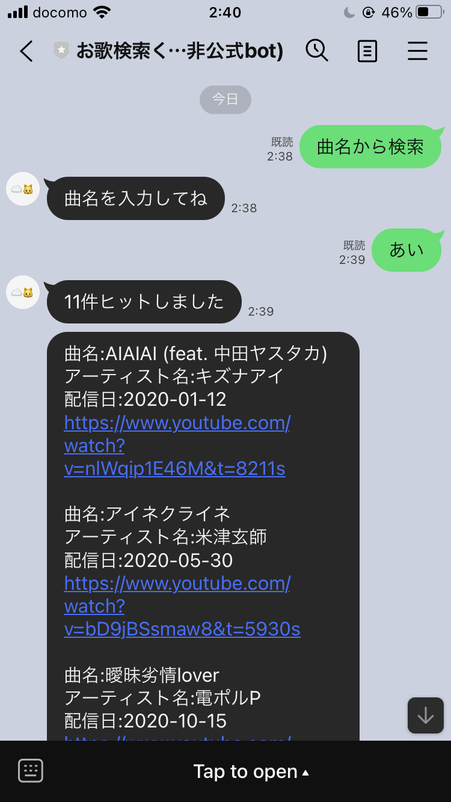

# 5回目更新

5回目の更新 
4回目からいくつかアプデを行ったため、変更点をまとめるため更新 

## したこと
1. アーティスト検索の際、vocaloidの検索をすることをやめた
    - アーティスト名とボカロ名を別々のカラムで保存している。
    - 'RADWIMPS'や'米津玄師'などの歌手、またボカロPは'アーティスト'カテゴリーで登録
    - '初音ミク'や'鏡音リン'などは'vocaloid'カテゴリーで分けている
    - 今まで -> アーティスト検索の際、'アーティスト' or 'vocaloid' で検索
        - ボカロ名で検索をかけると謎のエラーが発生
        - ボカロ名の検索をシステム側で制限
    - 修正後 -> 'アーティスト' のみで検索
        - sql側で制限をかけるようにした
    - 元々、別のカテゴリーなのだから一緒に検索をかける方が誤り

2. 登録元データでのプラットフォーム縛りをやめた
    - 今まで -> データをDBに入れる際、youtube以外のPFを弾いた状態でいれていた
    - 修正後 -> 元データをそのまま入れて、sqlでyoutube縛りにした

3. ファイルの受信を検知可能にした
    - ファイルから読み取りは未実装

4. 表示項目を変更
    - 今まで -> 曲名、配信日、配信タイトル
    - 修正後 -> 曲名、アーティスト名、配信日
        - **アーティスト検索をしやすい形に変更**  

## 次すること、したいこと
- 日付検索とタイトル検索って一緒なんじゃないか?
    - やっぱり使いづらい
    - リトル俺と検討した結果、廃止をオレの中で決定
- タイトル検索の代わりにどうする？
    - ユーザがDBを育てるという方向で進めている
    - ユーザから送られてくるデータ構成を統一したい
        - フォーマットをダウンロードできるようにする
        - **メニュー押下でフォーマットが送信されるようにしたい**
- (csv)ファイルから読み取って、DBにインする仕組みを作る
- 自作関数(sql)を作成する
- youtube apiを叩く
    - 日次で動くようにする

### ひとこと
- 寝る前の方がアイデアがでやすい気がする
- トライ&エラー、スクラップ&ビルドを継続
